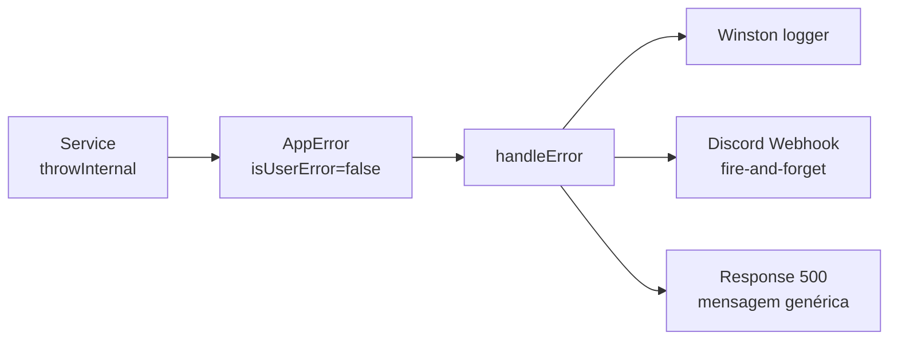

# Tratamento de Erros

Centralizado em `src/shared/utils/error.ts`.

---

## AppError

```typescript
class AppError extends Error {
  statusCode: number
  isUserError: boolean   // true → mensagem chega ao cliente
  issues?: AppErrorIssue[]
}
```

Dois tipos de erro com comportamentos distintos:

| Tipo | Função | Comportamento |
| --- | --- | --- |
| **Erro do usuário** | `throwUser(msg, status?, issues?)` | Retorna `msg` na response · sem log |
| **Erro interno** | `throwInternal(msg, status?)` | Loga no Winston + envia Discord · response genérica |

---

## Funções Helpers

```typescript
// Erro visível ao usuário (validação, recurso não encontrado, etc.)
throwUser("Usuário não encontrado", 404)

// Erro interno (falha de banco, serviço externo, etc.)
throwInternal("Falha ao conectar com o banco")

// Valida com Zod e lança throwUser se inválido
const data = parseSchema(createUserSchema, req.body)
```

---

## handleError

Usado nos controllers para fechar o ciclo de tratamento:

```typescript
async create(req: Request, res: Response) {
  try {
    const data = parseSchema(createUserSchema, req.body)
    const result = await this.userService.createUser(data)
    this.sendSuccessResponse(res, result)
  } catch (err) {
    handleError(err, res)
  }
}
```

`handleError` decide o que retornar:

- `AppError` com `isUserError=true` → responde com `statusCode` + `message` + `issues`
- `AppError` com `isUserError=false` → responde `500` com mensagem genérica
- Qualquer outro erro → responde `500`

---

## Fluxo de Erro Interno



> [!note] Discord é fire-and-forget
> A notificação não bloqueia a response. Se o webhook falhar, o erro é silenciado para não mascarar o erro original.

---

## Erros de Validação

`parseSchema` converte erros Zod em `AppError` com `issues`, retornando `400` por default:

```json
{
  "message": "Dados inválidos",
  "issues": [
    { "path": ["email"], "message": "Invalid email" },
    { "path": ["password"], "message": "String must contain at least 8 character(s)" }
  ]
}
```

---

## Relacionado

- [[guides/schemas-zod|Schemas Zod]] — como definir schemas de validação
- [[structure|Estrutura do Projeto]] — localização de `src/shared/utils/error.ts`
