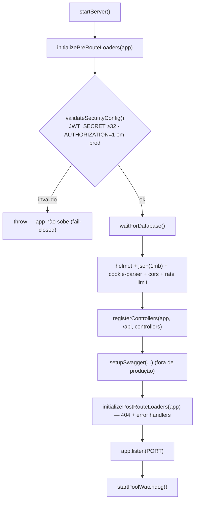
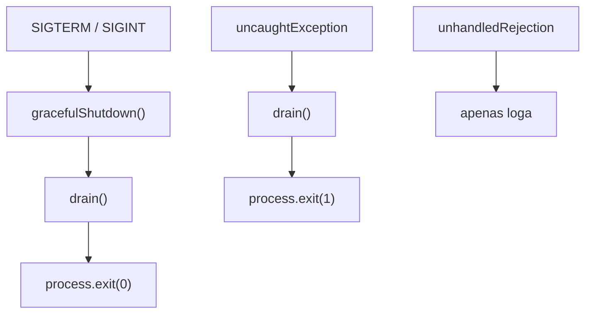

# Ciclo de Vida da Aplicação

Como a aplicação sobe, registra middlewares e desliga de forma graciosa. Implementado em [`src/index.ts`](../../src/index.ts) e [`src/shared/loaders/`](../../src/shared/loaders/).

---

## Bootstrap

Ordem garantida em `startServer()`:

1. **Pré-rota** (`initializePreRouteLoaders`):
   - `validateSecurityConfig()` — **fail-closed**: aborta o boot se `JWT_SECRET` ausente (ou < 32 chars em produção) ou se produção com `AUTHORIZATION != 1`; avisa se produção sem `DB_SSL`/`CORS_ORIGINS`. Ver [[seguranca]];
   - `waitForDatabase()` — espera o Postgres ficar disponível com backoff exponencial (1s→2s→…→30s, até 10 tentativas);
   - registra `trust proxy` (se `TRUST_PROXY` > 0), `helmet()`, `express.json({ limit: '1mb' })`, `cookie-parser` (necessário p/ ler o cookie JWT), `cors` (origens de `CORS_ORIGINS`) e `globalRateLimiter`.
2. **Rotas**: `registerControllers(app, "/api", controllers)`.
3. **Swagger**: `setupSwagger(...)` — pulado em produção.
4. **Pós-rota** (`initializePostRouteLoaders`): handler 404 + handler final de erro (4 parâmetros; 5xx genérico em produção — ver [[tratamento-de-erros#Handler final do Express]]).
5. `app.listen(PORT)`.
6. `startPoolWatchdog()` — monitor periódico dos pools (ver [[observabilidade]]).

> [!note] Falha de boot é fatal e visível
> `startServer().catch(...)` imprime `Fatal boot error: ...` no console e sai com `exit(1)`. Sem esse catch, a rejeição iria silenciosa para o rejections log do Winston e o processo ficaria vivo sem `listen`.

> [!warning] `waitForDatabase` antes do `listen`
> A app só passa a aceitar tráfego depois que o banco responde a `SELECT 1`. Em K8s/deploy isso evita servir requisições antes do banco estar pronto. O bootstrap recomendado é `waitForDatabase()` → migrations → `listen()` (rode as migrations no pipeline de deploy — ver [[migrations]]).

---

## Loaders

| Função | Arquivo | Papel |
| --- | --- | --- |
| `initializePreRouteLoaders(app)` | `loaders/index.ts` | `validateSecurityConfig()` (fail-closed), espera o banco, carrega middlewares pré-rota |
| `loadPreRouteMiddlewares(app)` | `loaders/express.ts` | `trust proxy` + `helmet` + `json(1mb)` + `cookie-parser` + `cors` + `globalRateLimiter` |
| `initializePostRouteLoaders(app)` | `loaders/index.ts` | Carrega handlers pós-rota |
| `loadPostRouteMiddlewares(app)` | `loaders/express.ts` | 404 → erro; handler final (5xx genérico em produção + log) |

---

## Graceful Shutdown

`pool.end()` sozinho não basta. O projeto separa **`drain`** (só fecha) de **`gracefulShutdown`** (decide o exit code).

`drain()` executa, em ordem:

1. `stopPoolWatchdog()` — para o monitor.
2. `server.close()` — para de aceitar novas conexões HTTP.
3. `drainPool(10_000)` — fecha `writePool` + `readPool` com timeout de 10s (sem o timeout, `pool.end()` pode travar para sempre).

Handlers globais:

| Sinal/Evento | Ação | Exit code |
| --- | --- | --- |
| `SIGTERM` / `SIGINT` | `gracefulShutdown` → `drain` | `0` |
| `uncaughtException` | `drain` | `1` |
| `unhandledRejection` | apenas `logger.error` | — (não derruba o processo) |

> [!important] Por que `uncaughtException` sai com `1`
> Se ele chamasse `gracefulShutdown` (exit `0`), o orquestrador (K8s/systemd) veria saída limpa mesmo num crash e poderia não aplicar a política de restart. Por isso o handler chama `drain()` direto e força `exit(1)`.

> [!tip] Kubernetes
> Configure `terminationGracePeriodSeconds` maior que o timeout do `drainPool` (ex.: 60s) e um hook `preStop: sleep 5` para dar tempo ao kube-proxy de remover o pod do endpoint antes do `SIGTERM`. Detalhes em [[postgres#15. Graceful shutdown]].

---

## Relacionado

- [[estrutura|Estrutura do Projeto]] — onde cada loader vive
- [[camada-de-acesso|Camada de Acesso a Dados]] — `drainPool`, `waitForDatabase`
- [[observabilidade|Observabilidade]] — watchdog do pool e logger
