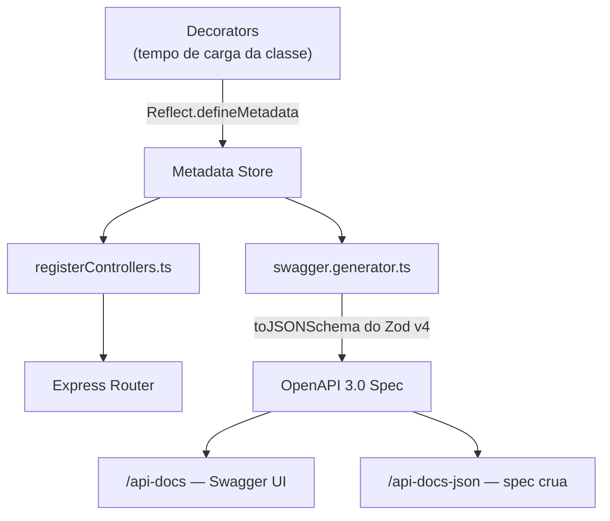

# Sistema de Decorators

O projeto usa decorators TypeScript com `reflect-metadata` para eliminar arquivos de rota separados e gerar a documentação Swagger automaticamente. Habilitado no `tsconfig.json` via `experimentalDecorators` + `emitDecoratorMetadata`.

---

## Decorators de Rota

Definidos em [`src/shared/core/decorators.ts`](../../src/shared/core/decorators.ts).

| Decorator | Alvo | Descrição |
| --- | --- | --- |
| `@Controller(prefix)` | Classe | Define o prefixo de todas as rotas da classe |
| `@Get(path)` | Método | Registra rota GET |
| `@Post(path)` | Método | Registra rota POST |
| `@Put(path)` | Método | Registra rota PUT |
| `@Patch(path)` | Método | Registra rota PATCH |
| `@Delete(path)` | Método | Registra rota DELETE |
| `@Middleware(...handlers)` | Método | Aplica middlewares à rota, **na ordem informada** |

> [!important] `@Controller` é importado como `@Route`
> Para não confundir com a **classe base** `Controller` (de `core/Controller.ts`), os controllers importam o decorator com alias:
> ```typescript
> import Controller from "@/shared/core/Controller";              // classe base
> import { Controller as Route, Get, Post } from "@/shared/core/decorators"; // decorator
>
> @Route("/user")
> class UserController extends Controller { ... }
> ```
> `@Route` e `@Controller` são **o mesmo decorator** — use o alias `@Route` por convenção do projeto.

### Exemplo

```typescript
@Route("/user")
class UserController extends Controller {

  @Get("/")
  @Middleware(
    paginationMiddleware(),
    jwtMiddleware.validJWTNeeded.bind(jwtMiddleware),
    adminMiddleware.adminOnly.bind(adminMiddleware),
  )
  async findAll(req: Request, res: Response) { ... }

  @Post("/")
  async create(req: Request, res: Response) { ... }
}
```

> [!note] Middlewares baseados em classe precisam de `.bind`
> `jwtMiddleware` e `adminMiddleware` são **instâncias** — passe `metodo.bind(instancia)` para preservar o `this`. Já `paginationMiddleware()` é uma factory: chame-a para obter o handler.

---

## Decorators Swagger

Definidos em [`src/shared/core/decorators/swagger.decorators.ts`](../../src/shared/core/decorators/swagger.decorators.ts) e reexportados pelo barrel `core/decorators/index.ts`.

| Decorator | Descrição |
| --- | --- |
| `@ApiTags(...tags)` | Agrupa rotas na UI do Swagger (classe ou método) |
| `@ApiSummary(resumo, descrição?)` | Título e descrição da operação |
| `@ApiBody(zodSchema, descrição?)` | Documenta o body da request a partir de um schema Zod |
| `@ApiResponse(status, descrição, zodSchema?)` | Documenta uma resposta (pode repetir por status) |
| `@ApiParam(nome, opções?)` | Documenta parâmetro de path ou query |

> [!important] Schema sempre em arquivo separado
> Nunca passe `z.object(...)` inline no decorator. Veja [[schemas-zod|Schemas Zod]].

### Exemplo completo

```typescript
@Route("/user")
@ApiTags("Usuários")
export class UserController extends Controller {

  @Get("/:id")
  @ApiSummary("Buscar usuário", "Retorna um usuário pelo ID")
  @ApiParam("id", { type: "integer", description: "ID do usuário" })
  @ApiResponse(200, "Usuário encontrado", userResponseSchema)
  @ApiResponse(404, "Não encontrado", messageResponseSchema)
  async findById(req: Request, res: Response) { ... }

  @Post("/")
  @ApiBody(createUserSchema, "Dados do novo usuário")
  @ApiResponse(201, "Usuário criado", createUserResponseSchema)
  async create(req: Request, res: Response) { ... }
}
```

---

## Como Funciona



1. Os decorators gravam metadados via `Reflect.defineMetadata` (prefixo, rotas, tags, body, respostas, params).
2. `registerControllers(app, "/api", controllers)` lê os metadados e registra cada rota no Express com seus middlewares, prefixada por `/api` + prefixo do controller.
3. `generateSwaggerSpec(...)` lê os mesmos metadados e converte os schemas Zod → JSON Schema com o `toJSONSchema` **nativo do Zod v4** (`target: "openapi-3.0"`; `z.date()` vira `string`/`date-time`).
4. A spec é servida em `/api-docs` (UI) e `/api-docs-json` (JSON cru).

> [!warning] Swagger não sobe em produção
> `setupSwagger` retorna cedo quando `NODE_ENV=production`. As rotas `/api-docs*` existem apenas fora de produção.

---

## Registro de Controllers

Em [`src/index.ts`](../../src/index.ts) a lista é passada para `registerControllers` e `setupSwagger`:

```typescript
const controllers = [
  AuthController,
  UserController,
  SystemController,
  // Adicione novos controllers aqui
];

registerControllers(app, "/api", controllers);
setupSwagger(app, "/api", controllers, { title: "Back Node API", version: "1.0.0", /* ... */ });
```

Cada controller é instanciado uma vez; o prefixo global `/api` é aplicado a todas as rotas.

---

## Relacionado

- [[schemas-zod|Schemas Zod]] — convenção de organização de schemas
- [[novo-modulo|Criar Novo Módulo]] — fluxo completo incluindo decorators
- [[tratamento-de-erros|Tratamento de Erros]] — `parseSchema` e `handleError` nos controllers
