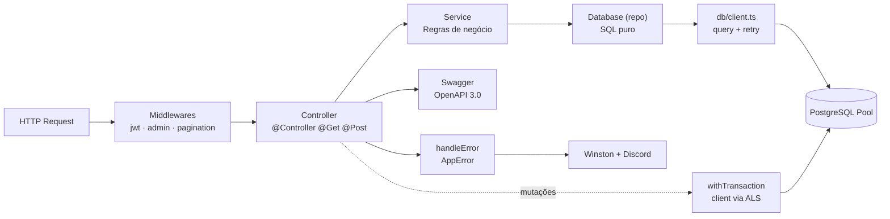

# Estrutura do Projeto

Árvore de diretórios, responsabilidade de cada camada e o caminho que uma requisição percorre.

## Árvore de Diretórios

```
base_node_pg/
├── src/
│   ├── index.ts                          # Entry point — Express, watchdog, graceful shutdown
│   ├── config/
│   │   └── index.ts                      # env tipado (lê .env via dotenv)
│   ├── db/                               # Infraestrutura PostgreSQL (sem ORM)
│   │   ├── pool.ts                       # writePool + readPool, drainPool
│   │   ├── client.ts                     # query() / readQuery() — retry + log sanitizado
│   │   ├── transaction.ts                # withTransaction (ALS) + cleanup e retry 40001/40P01
│   │   ├── health.ts                     # healthCheck em camadas + waitForDatabase
│   │   ├── metrics.ts                    # getPoolMetrics → { write, read }
│   │   ├── stream.ts                     # streamRows com pg-cursor
│   │   └── watchdog.ts                   # alerta Discord quando o pool satura
│   ├── modules/                          # Domínios da aplicação
│   │   ├── auth/
│   │   │   ├── auth.controller.ts
│   │   │   └── schemas/auth.schema.ts
│   │   ├── user/
│   │   │   ├── user.controller.ts
│   │   │   ├── user.service.ts
│   │   │   ├── user.database.ts
│   │   │   └── schema/user.schema.ts
│   │   └── system/
│   │       ├── system.controller.ts
│   │       └── schemas/system.schema.ts
│   └── shared/                           # Infraestrutura compartilhada
│       ├── core/
│       │   ├── Controller.ts             # Classe base dos controllers
│       │   ├── decorators.ts             # @Controller, @Get, @Post, @Middleware...
│       │   ├── registerControllers.ts    # Auto-registro no Express
│       │   ├── decorators/               # Barrel + decorators Swagger
│       │   │   ├── index.ts
│       │   │   └── swagger.decorators.ts # @ApiBody, @ApiResponse, @ApiTags...
│       │   └── swagger/
│       │       ├── swagger.generator.ts  # Gera spec OpenAPI 3.0 (zod → JSON Schema)
│       │       └── swagger.setup.ts      # Serve /api-docs e /api-docs-json
│       ├── infra/
│       │   └── database/Database.ts      # Classe base de repositórios (delega p/ db/client.ts)
│       ├── loaders/
│       │   ├── index.ts                  # Orquestra bootstrap (waitForDatabase, middlewares)
│       │   └── express.ts                # Middlewares pré/pós-rotas (json, cookie-parser, cors, 404, erros)
│       ├── middlewares/
│       │   ├── jwt.middleware.ts         # Valida JWT do cookie
│       │   └── admin.middleware.ts       # Verifica claim admin
│       └── utils/                        # Funções globais (ver [[funcoes-globais]])
│           ├── error.ts                  # AppError, throwUser, throwInternal, parseSchema, handleError
│           ├── pagination.ts             # Middleware e helpers de paginação (ALS)
│           ├── response_collection.ts    # Coleções de mensagens + status codes
│           ├── logger.ts                 # Winston (rotação diária)
│           ├── sendDiscord.ts            # Alertas via webhook
│           └── getDateTimeBr.ts          # Data/hora em America/Sao_Paulo
├── migrations/                           # SQL versionado — rodado pelo migration_user
├── scripts/migrate.ts                    # Runner com lock_timeout agressivo + checksum
├── doc/                                  # Esta documentação (vault Obsidian)
├── .env.example                          # Template de variáveis de ambiente
├── package.json · tsconfig.json · nodemon.json
├── Dockerfile · docker-compose.yml
└── bun.lock
```

> [!note] `src/db` vs `src/shared/infra/database`
> O acesso "puro" ao Postgres (pools, wrappers, transações) vive em `src/db`. Já `src/shared/infra/database/Database.ts` é a **classe base de repositório** que os módulos estendem — ela apenas delega para `src/db/client.ts`. Veja [[camada-de-acesso]].

---

## Camadas da Aplicação



| Camada | Arquivo | Responsabilidade |
| --- | --- | --- |
| **Controller** | `*.controller.ts` | Entrada HTTP: valida input (`parseSchema`), envolve mutações em `withTransaction`, responde, chama `handleError` |
| **Service** | `*.service.ts` | Regras de negócio, orquestra o Database, lança `throwUser`/`throwInternal` |
| **Database** | `*.database.ts` | SQL puro — estende `Database`, usa `this.query(...)` |
| **Schema** | `*.schema.ts` | Schemas Zod de entrada, resposta e tipos inferidos |
| **Core** | `core/*` | Decorators de rota/Swagger via `reflect-metadata` |
| **DB Infra** | `src/db/*` | Pool, `withTransaction`, health, métricas, streaming, watchdog |
| **Utils** | `shared/utils/*` | [[funcoes-globais|Funções globais]] reutilizáveis |

---

## Fluxo de uma Requisição

1. **Loaders pré-rota** já rodaram no boot: `json`, `cors` (ver [[ciclo-de-vida]]).
2. **Middlewares da rota** executam na ordem do `@Middleware(...)` — ex.: `paginationMiddleware()`, depois `jwtMiddleware`, depois `adminMiddleware`.
3. **Controller** valida o body com `parseSchema(schema, req.body)`.
4. Para operações que mutam estado, o controller envolve a chamada em `withTransaction(async () => ...)`.
5. **Service** executa a lógica e chama o **Database** (`this.query(sql, params)`).
6. `Database.query` delega para `db/client.ts`, que:
   - usa o `PoolClient` da transação ativa (via `AsyncLocalStorage`), se houver;
   - caso contrário, usa o `writePool` em autocommit.
7. Resposta via `res.status(...).json(...)`.
8. Em erro, o `catch` chama `handleError(err, res)` — ROLLBACK automático já ocorreu dentro de `withTransaction`.

---

## Variáveis de Ambiente

Definidas em [`.env`](../../.env.example) e tipadas em [`src/config/index.ts`](../../src/config/index.ts).

| Variável | Descrição |
| --- | --- |
| `PORT` | Porta HTTP |
| `APP_NAME` | `application_name` enviado ao Postgres (default `base_node_pg`) |
| `AUTHORIZATION` | `1` = JWT/admin obrigatórios · `0` = liberados (dev) |
| `JWT_SECRET` | Segredo para assinar/verificar tokens (obrigatório no boot) |
| `DB_HOST` / `DB_PORT` / `DB_NAME` | Conexão PostgreSQL |
| `DB_APP_USER` / `DB_APP_PASSWORD` | Usuário da aplicação (DML) |
| `DB_MIGRATION_USER` / `DB_MIGRATION_PASSWORD` | Usuário de DDL (cai no app user em dev) |
| `DB_SSL` / `DB_SSL_CA` | TLS — `true` + CA PEM em produção (`verify-full`) |
| `DB_POOL_MAX` / `DB_POOL_MIN` | Pool de escrita (default 16/2) |
| `DB_STATEMENT_TIMEOUT_MS` | Default 10 000 |
| `DB_QUERY_TIMEOUT_MS` | Default 12 000 — deve ser **maior** que `statement_timeout` |
| `DB_LOCK_TIMEOUT_MS` | Default 3 000 |
| `DB_IDLE_TX_TIMEOUT_MS` | `idle_in_transaction_session_timeout` — default 15 000 |
| `DB_IDLE_TIMEOUT_MS` / `DB_CONNECTION_TIMEOUT_MS` | Internos do pool (10 000 / 2 000) |
| `DB_MAX_LIFETIME_SECONDS` | Default 1 800 — NUNCA deixar em 0 |
| `DB_READ_HOST` / `DB_READ_PORT` / `DB_READ_POOL_MAX` / `DB_READ_POOL_MIN` | Réplica de leitura (vazio → aponta ao primário) |
| `DB_TIMEZONE` | Aplicado via startup packet (default `America/Sao_Paulo`) |
| `DISCORD_WEBHOOK` | Webhook para alertas de erro e saturação de pool |
| `POOL_WATCHDOG_INTERVAL_MS` / `_SATURATION_TICKS` / `_COOLDOWN_MS` | Watchdog do pool (10 000 / 3 / 300 000) |
| `LOG_LEVEL` | Nível do Winston (default `info`) |

---

## Relacionado

- [[decorators|Sistema de Decorators]] — como `@Controller` e `@ApiBody` funcionam
- [[ciclo-de-vida|Ciclo de Vida]] — bootstrap e shutdown
- [[camada-de-acesso|Camada de Acesso a Dados]] — `Database` e transações
- [[novo-modulo|Criar Novo Módulo]] — exemplo de ponta a ponta
