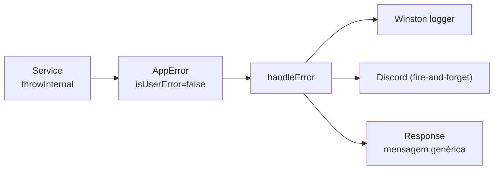

# Tratamento de Erros

Centralizado em [`src/shared/utils/error.ts`](../../src/shared/utils/error.ts). São **funções globais** usadas em toda a aplicação (ver também [[funcoes-globais]]).

---

## AppError

```typescript
class AppError extends Error {
  readonly statusCode: number;
  readonly isUserError: boolean;   // true → mensagem chega ao cliente
  readonly issues?: { path: string; message: string }[];
}
```

Dois tipos de erro com comportamentos distintos:

| Tipo | Função | Comportamento |
| --- | --- | --- |
| **Erro do usuário** | `throwUser(msg, status?, issues?)` | Retorna `msg` na response · **sem log, sem Discord** |
| **Erro interno** | `throwInternal(msg, status?)` | Loga no Winston + envia Discord · response genérica |

Defaults: `throwUser` → `400`; `throwInternal` → `500`.

---

## Funções Helpers

```typescript
import { throwUser, throwInternal, parseSchema, handleError } from "@/shared/utils/error";

// Erro visível ao usuário (validação, recurso não encontrado, regra de negócio)
throwUser("Usuário não encontrado", 404);

// Erro interno (falha de banco, serviço externo) — vira mensagem genérica + alerta
throwInternal("Falha ao criar usuário");

// Valida com Zod; lança AppError (isUserError, 400) com issues se inválido
const data = parseSchema(createUserSchema, req.body);
```

> [!note] `throw*` retornam `never`
> Por serem tipadas como `never`, o TypeScript entende que o fluxo termina ali — não é preciso `return` após chamá-las.

---

## handleError

Fecha o ciclo nos controllers (sempre no `catch`):

```typescript
async create(req: Request, res: Response) {
  try {
    const data = parseSchema(createUserSchema, req.body);
    const result = await withTransaction(() => this.userService.createUser(data));
    return res.status(201).json({ data: result });
  } catch (err) {
    return handleError(err, res);
  }
}
```

`handleError` decide a resposta:

- `AppError` com `isUserError = true` → responde `statusCode` + `message` (+ `issues`, se houver).
- `AppError` com `isUserError = false` → loga + Discord, responde `statusCode` com `"Ocorreu um erro interno"`.
- Qualquer outro erro → loga + Discord, responde `500` genérico.

---

## Fluxo de Erro Interno



> [!note] Discord é fire-and-forget
> A notificação (`sendDiscord.sendErrorAlert`) não bloqueia a resposta. Se o webhook falhar, a falha é apenas logada (`logger.warn`) — nunca mascara o erro original. Em produção a stack não vai para o console (só para o arquivo de log). Ver [[observabilidade]].

---

## Erros de Validação

`parseSchema` converte issues do Zod em `AppError` (status `400`):

```json
{
  "message": "Dados inválidos",
  "issues": [
    { "path": "email", "message": "email inválido" },
    { "path": "password", "message": "password deve ter no mínimo 6 caracteres" }
  ]
}
```

`path` é o caminho do campo já achatado com `.` (ex.: `endereco.cep`).

---

## Classe base `Controller`

[`src/shared/core/Controller.ts`](../../src/shared/core/Controller.ts) oferece dois helpers protegidos:

| Método | Comportamento |
| --- | --- |
| `sendSuccessResponse(res, data)` | Responde **sempre `200`** com `data` em JSON |
| `sendErrorMessage(res, error, defaultMsg?)` | Loga no console e responde `400` com a mensagem |

> [!warning] `sendSuccessResponse` ignora status customizado
> Ele responde **sempre 200**. Para `201`/`204` ou qualquer outro status, use `res.status(...).json(...)` diretamente — é o padrão adotado nos controllers do projeto. Para erros, prefira `handleError(err, res)` (mais completo que `sendErrorMessage`).

---

## Relacionado

- [[schemas-zod|Schemas Zod]] — como definir schemas de validação
- [[funcoes-globais|Funções Globais]] — catálogo de helpers, incluindo erros
- [[observabilidade|Observabilidade]] — logger e alertas Discord
