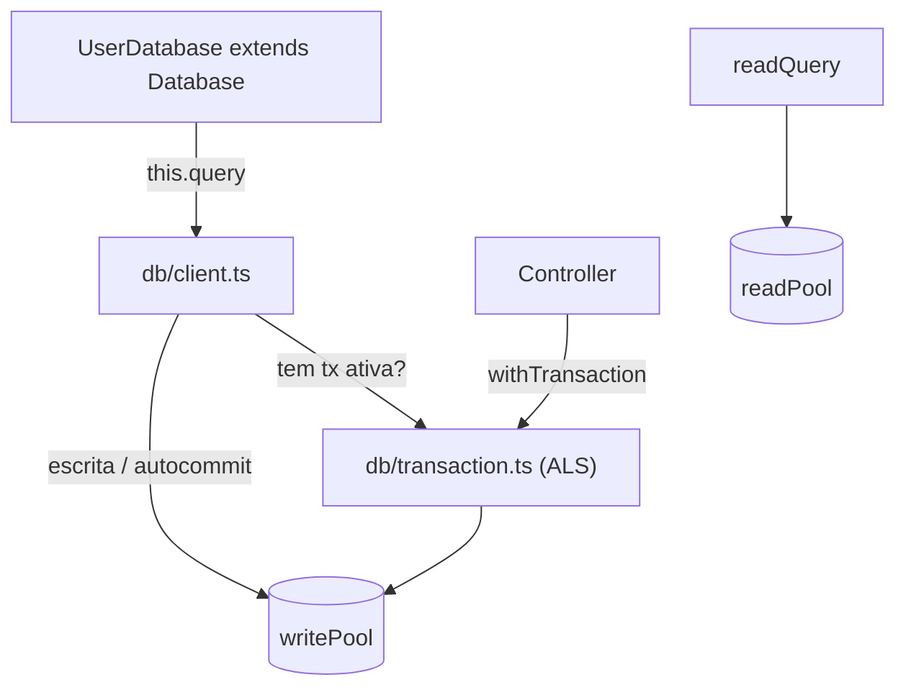

# Camada de Acesso a Dados

API prática da infraestrutura PostgreSQL do projeto (`src/db/*` e `src/shared/infra/database/Database.ts`). Sem ORM — SQL puro com `pg`. Para decisões de produção (dimensionamento, segurança, PgBouncer), veja [[postgres|Guia PostgreSQL]].

---

## Visão geral



| Arquivo | Exporta | Para quê |
| --- | --- | --- |
| `db/pool.ts` | `writePool`, `readPool`, `drainPool` | Pools de escrita e leitura |
| `db/client.ts` | `query`, `readQuery`, `QueryOptions` | Wrappers com retry e log sanitizado |
| `db/transaction.ts` | `withTransaction`, `isInTransaction`, `getTxClient` | Transações com cleanup e retry |
| `db/health.ts` | `healthCheck`, `waitForDatabase` | Liveness/readiness e boot resiliente |
| `db/metrics.ts` | `getPoolMetrics` | Stats dos pools (`{ write, read }`) |
| `db/stream.ts` | `streamRows` | Streaming de resultados grandes (cursor) |
| `db/watchdog.ts` | `startPoolWatchdog`, `stopPoolWatchdog` | Alerta Discord em saturação |
| `shared/infra/database/Database.ts` | `Database` (classe base) | Repositórios dos módulos |

---

## Classe base `Database`

Repositórios de módulo estendem `Database` e chamam `this.query(...)` — sem abrir/fechar conexão manualmente.

```typescript
import Database from "@/shared/infra/database/Database";

export default class UserDatabase extends Database {
  async findById(id: number) {
    const result = await this.query<DbUserRow>(
      `SELECT * FROM "user" WHERE id = $1 LIMIT 1`,
      [id],
    );
    return result.rows[0] ?? null;
  }
}
```

`this.query` delega para `query()` de `db/client.ts`, que resolve automaticamente:

- o `PoolClient` da **transação ativa** (via `AsyncLocalStorage`), se houver;
- caso contrário, o `writePool` em autocommit.

---

## `query()` e `readQuery()`

```typescript
import { query, readQuery } from "@/db/client";

// Escrita / leitura forte (sempre primário; usa o client da tx se houver)
await query<Row>("UPDATE \"user\" SET is_active = FALSE WHERE id = $1", [id]);

// Leitura na réplica (NÃO usar dentro de transação)
await readQuery<Row>("SELECT * FROM \"user\" WHERE is_active = TRUE");
```

`QueryOptions` (3º parâmetro de `query`):

| Opção | Efeito |
| --- | --- |
| `noRetry: true` | Desativa retry — **obrigatório em queries não-idempotentes** (`INSERT` simples, contadores) |
| `client: PoolClient` | Usa um client explícito (raro — `withTransaction` já cobre via ALS) |

Comportamento:

- **Log de slow query** acima de `500ms` (`logger.warn`). Os `params` **nunca** são logados — só `paramCount`.
- **Retry** automático (até 3x, backoff exponencial + jitter) para erros transientes: `08*`, `57P03` e erros de socket (`ECONNRESET`, `ECONNREFUSED`, `EPIPE`, `ETIMEDOUT`).
- Dentro de transação **não há retry** (a transação é controlada por `withTransaction`).

> [!warning] Retry só é seguro em queries idempotentes
> `UPDATE ... WHERE id`, `DELETE`, `INSERT ... ON CONFLICT DO NOTHING` podem repetir. Para `INSERT` simples passe `{ noRetry: true }` — é o que o `UserDatabase.createUser` faz.

| Cenário | Função |
| --- | --- |
| `SELECT` sem consistência forte (listas, dashboards) | `readQuery()` |
| `INSERT/UPDATE/DELETE` autocommit | `query()` |
| Qualquer query dentro de `withTransaction` | `query()` / `this.query()` (pega o client via ALS) |
| Leitura logo após escrita do mesmo usuário | `query()` (força primário — evita replication lag) |

---

## Transações — `withTransaction`

```typescript
import { withTransaction } from "@/db/transaction";

await withTransaction(async () => {
  await this.userService.createUser(data);   // qualquer this.query() aqui usa o client da tx
});
```

Assinatura: `withTransaction(fn, isolation?, maxRetries?)`.

- `isolation`: `"READ COMMITTED"` (default) · `"REPEATABLE READ"` · `"SERIALIZABLE"`.
- `BEGIN ISOLATION LEVEL X` em **uma** round trip.
- **Retry** para `40001` (serialization) e `40P01` (deadlock) com backoff + jitter (default 3x p/ SERIALIZABLE, 2x p/ os demais).
- **Cleanup correto**: em erro fatal de conexão (`08*`/`57P0*`/socket) ou ROLLBACK que falhou, o client é destruído com `client.release(true)` em vez de devolvido envenenado ao pool.

> [!danger] `fn` pode rodar mais de uma vez
> Por causa do retry de deadlock/serialization, **não** envie email/SMS, chame API externa ou publique em fila dentro de `fn`, e não dependa de timestamps capturados antes do `BEGIN`. Use o padrão **outbox**: grave o evento numa tabela dentro da tx e dispare o efeito colateral num worker separado. Deadlock ocorre em qualquer isolation level — inclusive READ COMMITTED.

`isInTransaction()` indica se há transação no contexto atual; `getTxClient()` devolve o client (uso interno do wrapper).

---

## Streaming — `streamRows`

Para `SELECT` que retorna muitos registros (evita OOM), usando `pg-cursor`:

```typescript
import { streamRows } from "@/db/stream";

for await (const row of streamRows<Row>("SELECT * FROM big_table WHERE x = $1", [x], 500)) {
  // processa lote a lote (batchSize default = 500)
}
```

O client é liberado com `release(true)` em erro (cursor envenenado), inclusive se `cursor.close()` falhar.

---

## Health & boot

```typescript
import { healthCheck, waitForDatabase } from "@/db/health";

await waitForDatabase();          // espera o banco no boot (backoff 1s→30s, 10 tentativas)
const result = await healthCheck(); // { status: "ok" | "degraded" | "down", detail: {...} }
```

`healthCheck` roda `SELECT 1` no `writePool` e inspeciona ambos os pools. Retorna `degraded` quando `waitingCount > 0`, `idleCount === 0` ou latência `> 1s`. Exposto em `GET /api/system/health` — ver [[sistema|Módulo Sistema]].

---

## Métricas — `getPoolMetrics`

```typescript
import { getPoolMetrics } from "@/db/metrics";

getPoolMetrics();
// { write: { totalCount, idleCount, waitingCount }, read: { ... } }
```

Exposto em `GET /api/system/metrics` e consumido pelo [[observabilidade#Watchdog do pool|watchdog]]. `waitingCount > 0` sustentado é o alarme de incêndio.

---

## Pools & shutdown — `pool.ts`

- `writePool` → primário (DML). `readPool` → réplica (`DB_READ_HOST`; cai no primário se vazio, com `application_name` distinto `{APP_NAME}_read`).
- Ambos registram `pool.on("error", ...)` — sem isso, um erro em client ocioso derruba o processo.
- `drainPool(timeoutMs = 10_000)` fecha os dois pools com timeout — usado no graceful shutdown (ver [[ciclo-de-vida]]).
- Timeouts e SSL configurados via `PoolConfig` a partir do `env`. Timezone via `options` (startup packet) — compatível com PgBouncer transaction mode.

---

## Relacionado

- [[postgres|Guia PostgreSQL (produção)]] — dimensionamento, segurança, réplicas, PgBouncer
- [[migrations|Migrations]] — DDL versionado
- [[usuarios|Módulo Usuários]] — exemplo real de repositório
